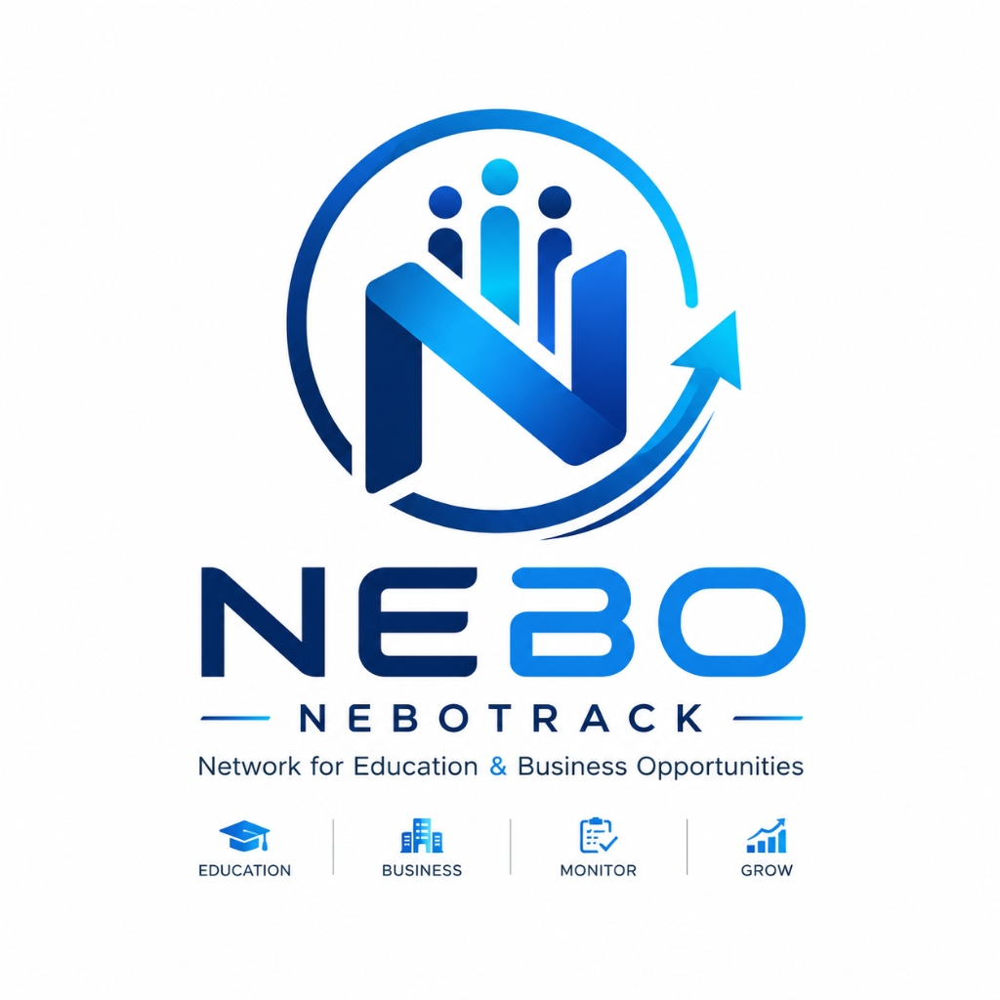
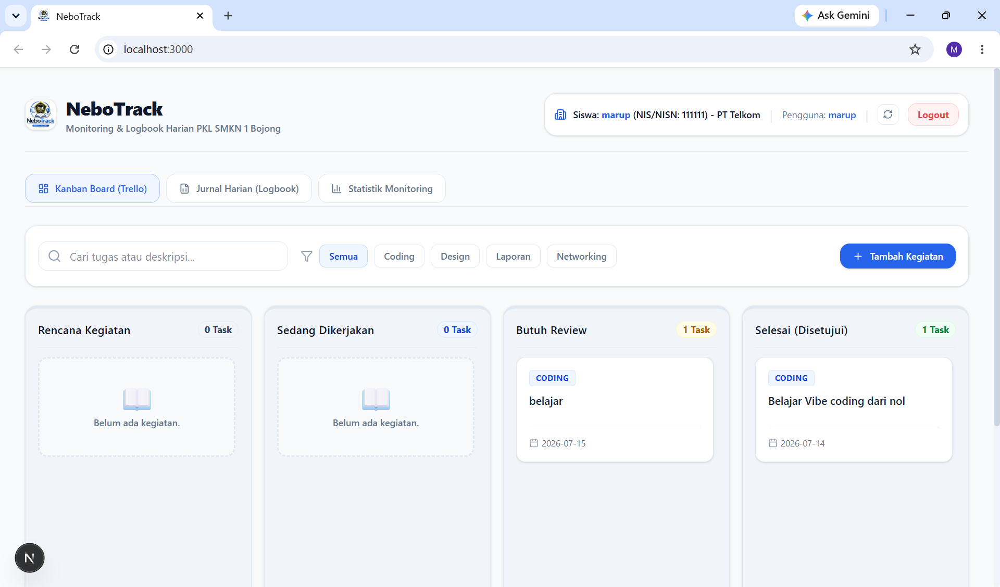
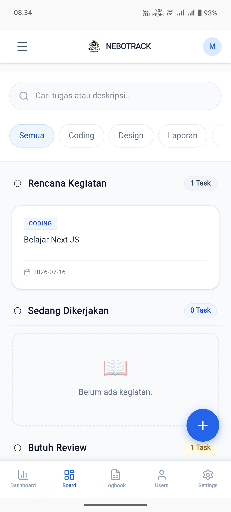

  
  <h1>🚀 NeboTrack (Web Monitoring PKL)</h1>
  

    <strong>Platform Eko-Sistem Monitoring & Presensi PKL Digital Generasi Baru Multi-Sekolah</strong>
     
    <em>Solusi Cerdas, Modern, Terintegrasi AI Biometrik, dan Real-Time Analytics.</em>
  

  

    
    
    
    
    
    
    
  

  

    <a href="#-tentang-nebotrack">Tentang</a> •
    <a href="#-kecanggihan--fitur-unggulan">Kecanggihan & Fitur</a> •
    <a href="#-ekosistem-teknologi">Teknologi</a> •
    <a href="#-peran--hak-akses-pengguna">Roles & Hak Akses</a> •
    <a href="#-tampilan-aplikasi">Tampilan UI</a>
  

---

## 📖 Tentang NeboTrack

**NeboTrack** adalah platform web monitoring dan manajemen **Praktek Kerja Lapangan (PKL)** terpadu yang dirancang untuk memfasilitasi kebutuhan **berbagai sekolah & institusi pendidikan**. NeboTrack menggantikan metode pencatatan manual/jurnal kertas dengan ekosistem digital berbasis **Web, AI, dan PWA**.

Platform ini mengintegrasikan seluruh proses PKL secara seamless antara 4 pihak: **Admin/SuperAdmin**, **Siswa**, **Guru Pembimbing (Internal)**, dan **Mentor Industri (Eksternal)**.

---

## 💡 Kecanggihan & Fitur Unggulan

NeboTrack dibekali berbagai teknologi mutakhir untuk memberikan pengalaman presensi dan pelaporan harian yang transparan, aman, serta efisien:

### 🤖 1. AI Biometric Face Recognition Verification
* Presensi harian (Check-In & Check-Out) dilengkapi verifikasi deteksi wajah berbasis AI secara *real-time* menggunakan engine `@vladmandic/face-api`.
* Memastikan validitas kehadiran siswa dan mencegah manipulasi titip presensi.

### 📍 2. GPS Geolocation & Geofencing Radius
* Validasi lokasi presensi berbasis GPS akurat dengan penghitungan jarak radius (*geofencing*) dari lokasi kantor/industri atau sekolah.
* Memastikan siswa berada di lokasi PKL yang sesuai saat melakukan pendaftaran kehadiran.

### 📲 3. Progressive Web App (PWA) Ready
* Menggunakan engine `@serwist/next` yang memungkinkan aplikasi di-install langsung di Smartphone (Android/iOS) maupun Desktop layaknya aplikasi native.
* Mendukung pembacaan data responsif dan performa tinggi secara instan.

### 📊 4. Interactive Analytics & Dynamic Dashboard
* Visualisasi data statistik performa siswa, tingkat kehadiran, serta progres logbook harian menggunakan grafik interaktif berbasis `Recharts`.
* Insight komprehensif bagi Guru dan Mentor untuk memantau perkembangan siswa secara visual.

### 📋 5. Dual Interface: Kanban Board & Mobile Timeline
* **Desktop Kanban View**: Fitur manajemen tugas interaktif (*Planning, In Progress, Review, Completed*) bergaya Trello untuk pengalaman kerja profesional di PC.
* **Mobile Timeline View**: Tampilan jurnal harian bergaya *timeline* yang fleksibel, cepat, dan nyaman diakses melalui perangkat mobile.

### ⚡ 6. Instant Approval System (Izin & WFH)
* Portal Guru Pembimbing dan Mentor dilengkapi modul persetujuan cepat (*Quick Approval/Rejection*) untuk permohonan **Izin** dan **WFH** siswa lengkap dengan riwayat status real-time.

### 📄 7. Instant Report Generator (PDF & Excel)
* Rekapitulasi absensi, jurnal harian, dan lembar evaluasi nilai dapat diekspor secara otomatis ke format **PDF** (menggunakan `jsPDF` & `jspdf-autotable`) maupun **Excel** (`SheetJS / XLSX`) dengan tata letak profesional siap cetak.

### 🔒 8. Keamanan & Kustomisasi Pengalaman Pengguna
* **Google reCAPTCHA**: Keamanan berlapis pada form autentikasi dari serangan bot.
* **Theme & Background Customizer**: Dukungan tema gelap/terang (*Dark/Light Mode*) serta pemilih latar belakang (*Background Picker*) yang dapat dipersonalisasi.
* **Private Notepad**: Catatan rahasia pribadi bagi siswa untuk mencatat poin penting pekerjaan secara mandiri.

---

## 🛠 Ekosistem Teknologi

| Layer / Fitur | Teknologi & Library | Deskripsi |
| :--- | :--- | :--- |
| **Core Framework** | **Next.js 16.2 (App Router)** | Framework React full-stack performa tinggi dengan Server Actions. |
| **Frontend UI** | **React 19.2 & TypeScript** | Library UI modern dengan struktur tipe data yang aman (*type-safe*). |
| **Styling & Theme** | **Tailwind CSS v4 & Next-Themes** | Design system modern, Glassmorphism, serta toggle Dark/Light Mode. |
| **AI Biometrics** | **@vladmandic/face-api** | Engine Machine Learning verifikasi & ekstraksi landmark wajah. |
| **PWA & Offline** | **Serwist (@serwist/next)** | Service Worker manager untuk kemampuan PWA & caching modern. |
| **Database & ORM** | **Prisma 6.16 & PostgreSQL / Supabase** | Management database relasional dengan skema terstruktur. |
| **Visual Analytics** | **Recharts** | Library chart deklaratif untuk grafik statistik & analytics dashboard. |
| **Icons & Media** | **Lucide React** | Set ikon modern dan konsisten. |
| **Document Generator**| **jsPDF, jsPDF-AutoTable & XLSX** | Ekspor laporan absensi & jurnal ke format PDF/Excel instan. |
| **Security & Email** | **Google reCAPTCHA & Resend** | Proteksi autentikasi bot & pengiriman notifikasi email. |

---

## 🎭 Peran & Hak Akses Pengguna (Roles)

NeboTrack menerapkan **Role-Based Access Control (RBAC)** yang aman untuk 4 peran pengguna:

| Role | Akses Utama & Fitur |
| :--- | :--- |
| **SuperAdmin / Admin** | Full akses manajemen user master, institusi sekolah, jurusan, plot perusahaan/industri, serta broadcast pengumuman sistem. |
| **Guru Pembimbing (Internal)** | Monitoring siswa bimbingan, approval permohonan Izin/WFH, verifikasi logbook harian, pemberian catatan pembimbing, dan cetak rekapitulasi nilai. |
| **Mentor Perusahaan (Eksternal)** | Review dan validasi kartu jurnal harian siswa, evaluasi kinerja industri, umpan balik (*feedback*), serta persetujuan presensi. |
| **Siswa PKL** | Mengisi presensi selfie (AI + GPS), membuat & mengelola tugas Kanban, mencatat logbook harian, mengajukan Izin/WFH, serta mengunduh rekap aktivitas. |

---

## 📸 Tampilan Aplikasi

  <table>
    <tr>
      <td align="center"><b>Desktop (Kanban & Portal)</b></td>
      <td align="center"><b>Mobile (Presensi & Timeline)</b></td>
    </tr>
    <tr>
      <td></td>
      <td></td>
    </tr>
  </table>

---

  
Dibuat dengan ❤️ untuk <b>Dunia Pendidikan & Vokasi Indonesia</b>

  

    
    
  

